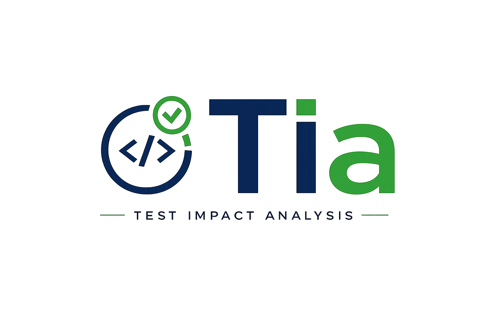

<!-- .slide: class="no-badge" -->

# Test Impact Analysis for the JVM

Speaker name &middot; date

---

## The problem

- Full test suites run on every change &mdash; even one-line edits.
- Most of those tests never touch the changed code.
- Cost shows up as **slow CI feedback**, **wasted compute**, and **noisy signal**.

Note: "I fixed a typo in `StringUtil` and 4000 tests just ran" — set the scene.

---

## What is Tia

> Runs **only the tests impacted by your code changes.**

- Selects tests **per change**, based on a coverage map built by previous runs.
- **Branch-aware** &mdash; each branch maintains its own mapping.
- **Drop-in** via Maven / Gradle plugin.
- JVM-focused today; principle applies to any language with coverage tooling.

---

## Benefits

- **Faster CI cycles** &mdash; shorter wait between push and signal.
- **Lower compute spend** &mdash; pay only for tests that matter.
- **Same effective coverage** for code that actually changed.
- **Stable mapping** &mdash; updates gated to CI; local runs don't pollute.
- **Branch isolation** &mdash; no bleed between feature branches.

Note: Tradeoff — mapping quality depends on representative CI runs.

---

## Supported frameworks & ecosystem

| Test frameworks | Build tools | VCS |
|---|---|---|
| JUnit 4 *(legacy)* | Maven (`tia-maven-plugin`) | Git |
| JUnit 5 (Jupiter) | Gradle (`tia-gradle` + variants) | Perforce |
| Spock 2.x | | |

Note: Spock support is independent of the JUnit 5 path even though Spock uses the JUnit Platform &mdash; Tia has a dedicated Spock listener.

---

## How it works &mdash; at a glance

- Two loops: **selection** (1 → 2 → 3 → 4) and **mapping update** (4 → 2).

---

## How it works &mdash; building the mapping

- Coverage captured per **suite**, then the agent's data is reset.

---

## How it works &mdash; selecting tests

- No mapping yet on this branch? &rarr; runs everything (safe default).
- Modified or newly-added test files &rarr; always run.
- Tests that failed last run &rarr; always re-run.

---

## What if no tests are selected?

- Every previously-tracked test goes into the **ignore list**.
- The Tia agent attaches `@Disabled` (or equivalent) to each ignored class at JVM load time.
- Surefire / Gradle still starts the test phase, but **almost nothing executes** &mdash; the phase completes in seconds.
- Any **new test file** not yet in the mapping still runs &mdash; it can't be in the ignore list.

Note: if there is no mapping for the branch at all, both runs and ignores are empty, so the agent disables nothing and the full suite runs — the safe-default path.

---

## How it works &mdash; branch & update model

- Mapping **keyed by branch**; each branch keeps its own HEAD pointer.
- Mapping updates gated to CI via `tiaUpdateDBMapping=true`.
- Local dev runs **read** but don't write &mdash; source-of-truth stays stable.
- Fresh branch &rarr; runs everything until the first successful CI mapping commit.

---

## How it works &mdash; tracking libraries

- Tia can also track changes in **in-repo source libraries** declared via `tiaSourceLibs`.
- The build plugin resolves each coordinate to a JAR + source directory.
- Library method changes invalidate suites just like in-project changes.
- Versioning policy (`BUMP_AT_RELEASE` / `BUMP_AFTER_RELEASE`) controls when a new version triggers re-mapping.

Note: useful for shared internal modules consumed via Maven/Gradle by the project under test.

---

## Live demo

---

<!-- .slide: class="no-badge" -->

# Q&A

<a href="https://github.com/mtgleeson/tiatesting">github.com/mtgleeson/tiatesting</a>

