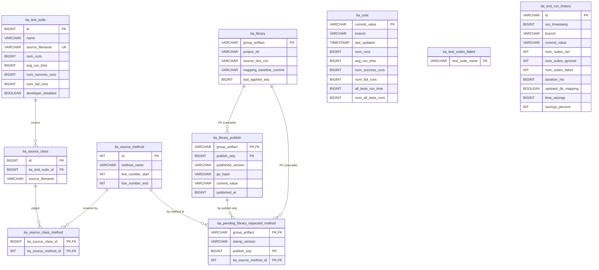

# Database schema (tables and relationships)

Tia stores everything in a single H2 database (embedded file or server mode). All DDL lives in
`H2DataStore` (`createTiaDB` plus the `buildCreate*TableSql` / `ensure*` helpers). The ten tables
fall into three clusters: the **mapping** cluster (what test covers what code - the bulk of the
data), the **library-impact** cluster (see the
[library publish-time stamping](library-publish-time-stamping.md) chapter), and a few
**standalone** header/audit tables.

(`tia_core`, `tia_test_suites_failed` and `tia_test_run_history` carry no foreign keys - they are
linked only logically, by commit / branch / suite name.)

### Table purposes

- **tia_core** - single-row header: the sealed `commit_value` the mapping is valid for, the branch,
  and the Tia-level aggregate run stats (selected-run average `avg_run_time`, full-suite baseline
  `all_tests_run_time`, run/success/fail counts).
- **tia_test_suite** - one row per tracked test suite: name, source file, per-suite run stats, and
  the `developer_disabled` flag (suite disabled in source by the developer, not ignored by Tia).
- **tia_source_class** - the source classes a given suite exercises; the first hop of the
  suite -> class -> method coverage mapping (`tia_test_suite_id` points back to the suite).
- **tia_source_method** - catalogue of every tracked source method with its line range; the unit of
  change-impact analysis.
- **tia_source_class_method** - the join table holding the coverage **edges** (which methods each
  tracked source-class row covers). This is the bulk of the database - millions of rows on a large
  project.
- **tia_test_suites_failed** - the set of suites with a pending failure, force-re-run on the next
  selection ("Running previously failed tests").
- **tia_test_run_history** - audit log: one row per run (timestamp, branch, commit, ran/ignored/
  failed counts, duration, frozen per-run savings). Drives the `history` task and HTML History tab.
- **tia_library** - tracked in-repo libraries for library-impact analysis: declared coordinates and
  source dirs (config-owned), the `mapping_baseline_commit` the publish stamper diffs from, and the
  `last_applied_seq` high-water mark used for downgrade warnings and reporting.
- **tia_library_publish** - the publish ledger: one row per published build of a tracked library,
  ordered per library by the `publish_seq` assigned at publish time. Gives builds the total order
  that version strings (shared across SNAPSHOT builds) and jar hashes (opaque) cannot provide.
- **tia_pending_library_impacted_method** - source methods impacted by a library publish, keyed by
  the publish sequence they shipped in (`stamp_version` is display-only) and awaiting "drain" once
  the consuming project resolves a build at or past that sequence (FK to `tia_library`,
  `ON DELETE CASCADE`).

The mapping read path runs this chain in reverse: a code change resolves changed files to
`tia_source_method` ids, those to the covering `tia_source_class_method` edges, and those up to the
`tia_test_suite`s that must run.

---

Prev: [The select-tests run-time estimate and its mapping overhead](select-tests-run-time-estimate.md) | [Back to the Wiki index](../WIKI.md) | Next: [Persist flow and crash safety](persist-flow-and-crash-safety.md)
