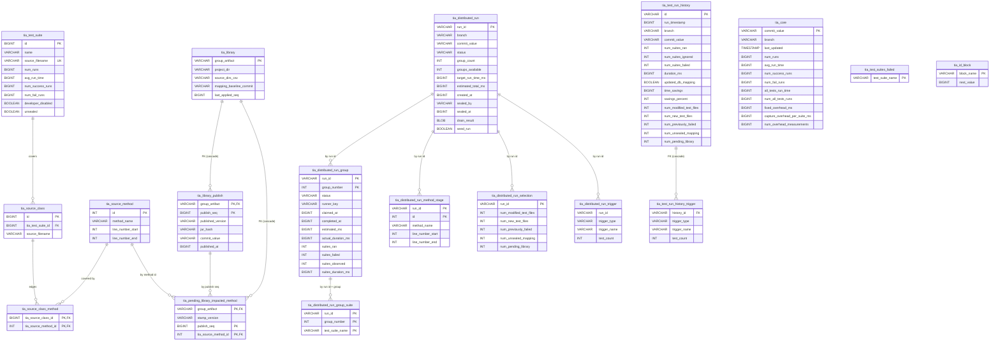

# Database schema (tables and relationships)

Tia stores everything in a single H2 database (embedded file or server mode) - or the equivalent
Postgres schema, see the [pluggable datastore](pluggable-datastore.md) chapter. All DDL lives in
`JdbcDataStore` (`createTiaDB` plus the `buildCreate*TableSql` / `ensure*` helpers). The tables
fall into four clusters: the **mapping** cluster (what test covers what code - the bulk of the
data), the **library-impact** cluster (see the
[library publish-time stamping](library-publish-time-stamping.md) chapter), the **distributed-run**
cluster (see the [distributed test runs](distributed-test-runs.md) chapter), and a few
**standalone** header/audit tables, one of which - `tia_id_block` - exists purely to allocate ids,
not to store mapping or audit data.

The distributed-run cluster is the only one whose rows are transient: they describe one in-flight
build, and the next plan write for the branch clears them. Two of its tables -
`tia_distributed_run_selection` and `tia_distributed_run_trigger` - along with
`tia_test_run_history_trigger` on the audit side, carry the per-run selection breakdown described
in the [Run history details](run-history-details.md) chapter; `tia_test_run_history_trigger` is
the one exception to "transient": it is cascade-deleted with its parent history row, not cleared
by a plan write.

```mermaid
erDiagram
    tia_test_suite ||--o{ tia_source_class : "covers"
    tia_source_class ||--o{ tia_source_class_method : "edges"
    tia_source_method ||--o{ tia_source_class_method : "covered by"
    tia_library ||--o{ tia_library_publish : "FK (cascade)"
    tia_library ||--o{ tia_pending_library_impacted_method : "FK (cascade)"
    tia_library_publish ||--o{ tia_pending_library_impacted_method : "by publish seq"
    tia_source_method ||--o{ tia_pending_library_impacted_method : "by method id"
    tia_distributed_run ||--o{ tia_distributed_run_group : "by run id"
    tia_distributed_run_group ||--o{ tia_distributed_run_group_suite : "by run id + group"
    tia_distributed_run ||--o{ tia_distributed_run_method_stage : "by run id"
    tia_distributed_run ||--o{ tia_distributed_run_selection : "by run id"
    tia_distributed_run ||--o{ tia_distributed_run_trigger : "by run id"
    tia_test_run_history ||--o{ tia_test_run_history_trigger : "FK (cascade)"

    tia_core {
        VARCHAR commit_value PK
        VARCHAR branch
        TIMESTAMP last_updated
        BIGINT num_runs
        BIGINT avg_run_time
        BIGINT num_success_runs
        BIGINT num_fail_runs
        BIGINT all_tests_run_time
        BIGINT num_all_tests_runs
        BIGINT fixed_overhead_ms
        BIGINT capture_overhead_per_suite_ms
        BIGINT num_overhead_measurements
    }

    tia_test_suite {
        BIGINT id PK
        VARCHAR name
        VARCHAR source_filename UK
        BIGINT num_runs
        BIGINT avg_run_time
        BIGINT num_success_runs
        BIGINT num_fail_runs
        BOOLEAN developer_disabled
        BOOLEAN unsealed
    }

    tia_source_class {
        BIGINT id PK
        BIGINT tia_test_suite_id FK
        VARCHAR source_filename
    }

    tia_source_method {
        INT id PK
        VARCHAR method_name
        INT line_number_start
        INT line_number_end
    }

    tia_source_class_method {
        BIGINT tia_source_class_id PK, FK
        INT tia_source_method_id PK, FK
    }

    tia_test_suites_failed {
        VARCHAR test_suite_name PK
    }

    tia_test_run_history {
        VARCHAR id PK
        BIGINT run_timestamp
        VARCHAR branch
        VARCHAR commit_value
        INT num_suites_ran
        INT num_suites_ignored
        INT num_suites_failed
        BIGINT duration_ms
        BOOLEAN updated_db_mapping
        BIGINT time_savings
        INT savings_percent
        INT num_modified_test_files
        INT num_new_test_files
        INT num_previously_failed
        INT num_unsealed_mapping
        INT num_pending_library
    }

    tia_test_run_history_trigger {
        VARCHAR history_id FK
        VARCHAR trigger_type
        VARCHAR trigger_name
        INT test_count
    }

    tia_library {
        VARCHAR group_artifact PK
        VARCHAR project_dir
        VARCHAR source_dirs_csv
        VARCHAR mapping_baseline_commit
        BIGINT last_applied_seq
    }

    tia_library_publish {
        VARCHAR group_artifact PK, FK
        BIGINT publish_seq PK
        VARCHAR published_version
        VARCHAR jar_hash
        VARCHAR commit_value
        BIGINT published_at
    }

    tia_pending_library_impacted_method {
        VARCHAR group_artifact PK, FK
        VARCHAR stamp_version
        BIGINT publish_seq PK
        INT tia_source_method_id PK, FK
    }

    tia_id_block {
        VARCHAR block_name PK
        BIGINT next_value
    }

    tia_distributed_run {
        VARCHAR run_id PK
        VARCHAR branch
        VARCHAR commit_value
        VARCHAR status
        INT group_count
        INT groups_available
        BIGINT target_run_time_ms
        BIGINT estimated_total_ms
        BIGINT created_at
        VARCHAR sealed_by
        BIGINT sealed_at
        BLOB drain_result
        BOOLEAN seed_run
    }

    tia_distributed_run_group {
        VARCHAR run_id PK
        INT group_number PK
        VARCHAR status
        VARCHAR runner_key
        BIGINT claimed_at
        BIGINT completed_at
        BIGINT estimated_ms
        BIGINT actual_duration_ms
        INT suites_ran
        INT suites_failed
        INT suites_observed
        BIGINT suites_duration_ms
    }

    tia_distributed_run_group_suite {
        VARCHAR run_id PK
        INT group_number PK
        VARCHAR test_suite_name PK
    }

    tia_distributed_run_method_stage {
        VARCHAR run_id PK
        INT id PK
        VARCHAR method_name
        INT line_number_start
        INT line_number_end
    }

    tia_distributed_run_selection {
        VARCHAR run_id PK
        INT num_modified_test_files
        INT num_new_test_files
        INT num_previously_failed
        INT num_unsealed_mapping
        INT num_pending_library
    }

    tia_distributed_run_trigger {
        VARCHAR run_id
        VARCHAR trigger_type
        VARCHAR trigger_name
        INT test_count
    }
```

(`tia_core`, `tia_test_suites_failed`, `tia_test_run_history` and `tia_id_block` carry no foreign
keys - they are linked only logically, by commit / branch / suite name, or - for `tia_id_block` -
not linked to other rows at all; it is consulted, not joined against. The six
`tia_distributed_run*` tables carry no declared foreign keys either - they are linked by `run_id`,
and the plan write clears all six as a set before inserting, rather than relying on cascades.
`tia_test_run_history_trigger` is the exception on the audit side: it does carry a declared FK back
to `tia_test_run_history.id`, `ON DELETE CASCADE`, so a history row's triggers are removed with it
rather than needing their own cleanup.)

### Table purposes

- **tia_core** - single-row header: the sealed `commit_value` the mapping is valid for, the branch,
  and the Tia-level aggregate run stats (selected-run average `avg_run_time`, full-suite baseline
  `all_tests_run_time`, run/success/fail counts). It also carries the two-part overhead model -
  `fixed_overhead_ms` (what a test JVM costs to start, charged once per runner) and
  `capture_overhead_per_suite_ms` (JaCoCo's per-suite dump), as rolling averages over the
  `num_overhead_measurements` distributed builds that measured them. All three are `0` until a
  project runs its first distributed build, which is the signal for the estimate to fall back to
  the older single-number overhead. See the "The two-part overhead model" section of the
  distributed test runs chapter.
- **tia_test_suite** - one row per tracked test suite: name, source file, per-suite run stats, the
  `developer_disabled` flag (suite disabled in source by the developer, not ignored by Tia), and the
  `unsealed` flag - set when this suite's mapping edges were written by a run whose seal has not
  yet completed, cleared by the next seal. See the "Persist flow and crash safety" chapter.
- **tia_source_class** - the source classes a given suite exercises; the first hop of the
  suite -> class -> method coverage mapping (`tia_test_suite_id` points back to the suite).
- **tia_source_method** - catalogue of every tracked source method with its line range; the unit of
  change-impact analysis.
- **tia_source_class_method** - the join table holding the coverage **edges** (which methods each
  tracked source-class row covers). This is the bulk of the database - millions of rows on a large
  project.
- **tia_test_suites_failed** - the set of suites with a pending failure, force-re-run on the next
  selection ("Running previously failed tests").
- **tia_test_run_history** - audit log: one row per run (timestamp, branch, commit, ran/ignored/
  failed counts, duration, frozen per-run savings). Drives the `history` task and HTML History tab.
  Also carries five nullable selection-source counters (`num_modified_test_files`,
  `num_new_test_files`, `num_previously_failed`, `num_unsealed_mapping`, `num_pending_library`) -
  null means "not recorded" rather than zero. See the
  [Run history details](run-history-details.md) chapter.
- **tia_test_run_history_trigger** - the per-changed-method and per-static-rule selection triggers
  behind one history row's counters, each with a suite count; FK to `tia_test_run_history.id`,
  `ON DELETE CASCADE`. Loaded only on demand - by the per-run detail page and the history-details
  CLI command - never by the hot `readTestRunHistory()` path. See the
  [Run history details](run-history-details.md) chapter.
- **tia_library** - tracked in-repo libraries for library-impact analysis: declared coordinates and
  source dirs (config-owned), the `mapping_baseline_commit` the publish stamper diffs from, and the
  `last_applied_seq` high-water mark used for downgrade warnings and reporting.
- **tia_library_publish** - the publish ledger: one row per published build of a tracked library,
  ordered per library by the `publish_seq` assigned at publish time. Gives builds the total order
  that version strings (shared across SNAPSHOT builds) and jar hashes (opaque) cannot provide.
- **tia_pending_library_impacted_method** - source methods impacted by a library publish, keyed by
  the publish sequence they shipped in (`stamp_version` is display-only) and awaiting "drain" once
  the consuming project resolves a build at or past that sequence (FK to `tia_library`,
  `ON DELETE CASCADE`).
- **tia_id_block** - one row per named id counter (currently just `tia_source_class`), holding the
  next id to hand out. `allocateSourceClassIdBlock` locks a counter row with `SELECT ... FOR UPDATE`
  and advances it by the size of the block a writer needs, so concurrent writers reserve disjoint
  id ranges instead of both computing the same `MAX(id) + 1` and colliding on the primary key.
- **tia_distributed_run** - one row per distributed run, keyed by the user-supplied `run_id`: the
  branch and commit the plan was built from (authoritative for the seal), the run's `status` (`OPEN`
  / `SEALED`), the plan's shape, and `sealed_by` / `sealed_at` - the election record whose `IS NULL`
  predicate is what makes exactly one runner the sealer. A plan with no groups - nothing was
  selected - is sealed by the plan step itself, recorded as `<run_id>-planner`. `drain_result`
  carries the library-impact drain the plan computed, for the sealer to apply once. `seed_run`
  records that the planner collapsed this run to a single group with no suite names because the
  branch had no stored mapping yet - the seal reads it to tell that build (which ran everything and
  ignored nothing) from a nothing-impacted one, which has no groups at all and ignored every tracked
  suite. Nothing else in the row separates the two, which is why the planner's answer is stored
  rather than re-derived.
- **tia_distributed_run_group** - one row per group: its `status` (`PENDING` / `CLAIMED` /
  `COMPLETED`), the `runner_key` that claimed it, the planner's `estimated_ms`, and the progress
  figures each persist accumulates. `suites_observed` is the one the completeness guard reads -
  see the "Distributed test runs" chapter for why it is not `suites_ran`. `suites_duration_ms` is
  the share of `actual_duration_ms` that went on named suites; the remainder is the runner's fixed
  per-JVM overhead, which the sealer charges once for the build rather than once per group. Indexed
  on (`run_id`, `status`) for the claim's lowest-`PENDING` lookup.
- **tia_distributed_run_group_suite** - the plan's assignment: which suite names belong to which
  group. Also the denominator the completeness guard counts.
- **tia_distributed_run_method_stage** - staged method trackers from every runner, held until the
  sealer rebuilds `tia_source_method` from them. Staged rather than written directly because no
  single runner sees the whole build's methods.
- **tia_distributed_run_selection** - one row per distributed run, staging the same five
  selection-source counters `tia_test_run_history` stores. Written at plan time; the sealer copies
  it onto the build's single history row. See the
  [Run history details](run-history-details.md) chapter.
- **tia_distributed_run_trigger** - the per-changed-method and per-static-rule triggers staged for
  a distributed run, mirroring `tia_test_run_history_trigger`'s shape but keyed by `run_id` rather
  than `history_id`, with no foreign key. Copied onto `tia_test_run_history_trigger` at seal time.
  See the [Run history details](run-history-details.md) chapter.

The mapping read path runs this chain in reverse: a code change resolves changed files to
`tia_source_method` ids, those to the covering `tia_source_class_method` edges, and those up to the
`tia_test_suite`s that must run.

---

Prev: [The select-tests run-time estimate and its overhead model](select-tests-run-time-estimate.md) | [Back to the Wiki index](../WIKI.md) | Next: [Persist flow and crash safety](persist-flow-and-crash-safety.md)
